# Lucrare de laborator Nr. 4: Utilizarea containerelor ca medii de execuție

# Scopul:
Dupa executarea acestei lucrări, studentul va fi capabil să pregătească un container pentru a rula un site web bazat pe Apache HTTP Server + PHP (mod_php) + MariaDB.

# Sarcina:
Creați un fișier Dockerfile pentru a construi o imagine a containerului care va conține un site web bazat pe Apache HTTP Server + PHP (mod_php) + MariaDB. Baza de date MariaDB trebuie să fie stocată într-un volum montat. Serverul trebuie să fie disponibil pe portul 8000.

Instalați site-ul WordPress. Verificați funcționarea site-ului.

## Pregătire
Pentru a efectua această lucrare, trebuie să aveți instalat pe computer Docker.

Pentru a efectua această lucrare, trebuie să aveți experiență în efectuarea lucrării de laborator nr. 3.

# Executarea:

## Crearea depozitului și clonarea
- A fost creat un depozit de cod sursă numit `containers04`.
- Depozitul a fost clonat pe computerul local.

## Structura directorului
- În directorul `containers04` a fost creat un subdirector `files` cu următoarele subdirectoare:
  - `files/apache2` - pentru fișierele de configurare Apache2.
  - `files/php` - pentru fișierele de configurare PHP.
  - `files/mariadb` - pentru fișierele de configurare MariaDB.

## Crearea fișierului Dockerfile inițial
- În directorul `containers04` a fost creat fișierul `Dockerfile` cu următorul conținut:

FROM debian:latest
RUN apt-get update && \
    apt-get install -y apache2 php libapache2-mod-php php-mysql mariadb-server && \
    apt-get clean

## Crearea primii versiuni a imaginii apache2-php-mariadb
- Sa folosit comanda:
  - docker build -t apache2-php-mariadb .


## Crearea primii versiuni a conteinerului apache2-php-mariadb
- Sa folosit comanda:
  - docker container run -d --name apache2-php-mariadb apache2-php-mariadb


## Copierea fișierele de configurare apache2, php, mariadb în directorul files/ de pe computer din conteiner
- Comenzile folosite:
  - docker cp apache2-php-mariadb:/etc/apache2/sites-available/000-default.conf files/apache2/
  - docker cp apache2-php-mariadb:/etc/apache2/apache2.conf files/apache2/
  - docker cp apache2-php-mariadb:/etc/php/8.2/apache2/php.ini files/php/
  - docker cp apache2-php-mariadb:/etc/mysql/mariadb.conf.d/50-server.cnf files/mariadb/


- Directoarele dupa copiere:


## Verificam daca conteinerul exista:
- sa folosit comanda
  - docker ps
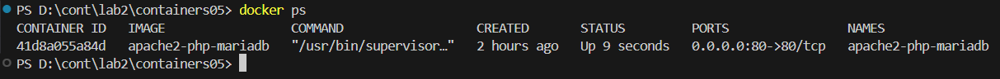

## Containerul exista deci putem sal stergem
- comenzile:
 - docker container stop apache2-php-mariadb
 - docker container rm apache2-php-mariadb


## Modifiecarea fisierelor copiate:
### Fisierul: files/apache2/000-default.conf
 - sa gasit linia:' #ServerName www.example.com ' și sa înlocuit cu linia: ' ServerName localhost '
 - sa gasit linia:' ServerAdmin webmaster@localhost ' și sa înlocuit adresa de e-mail cu adresa personala
 - sa gasit linia:' DocumentRoot /var/www/html ' și dupa aceasta sa inserat comanda: ' DirectoryIndex index.php index.html '
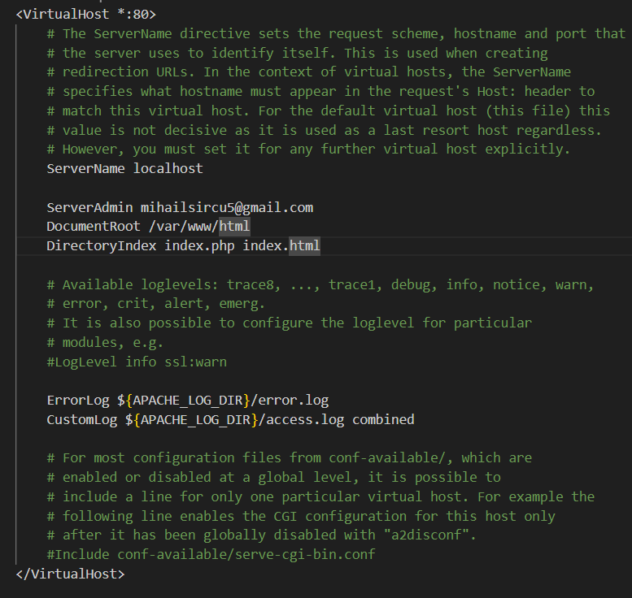
### Fisierul: files/apache2/apache2.conf
 - sa introdus la sfirsitul fisierului comanda: ' ServerName localhost '
 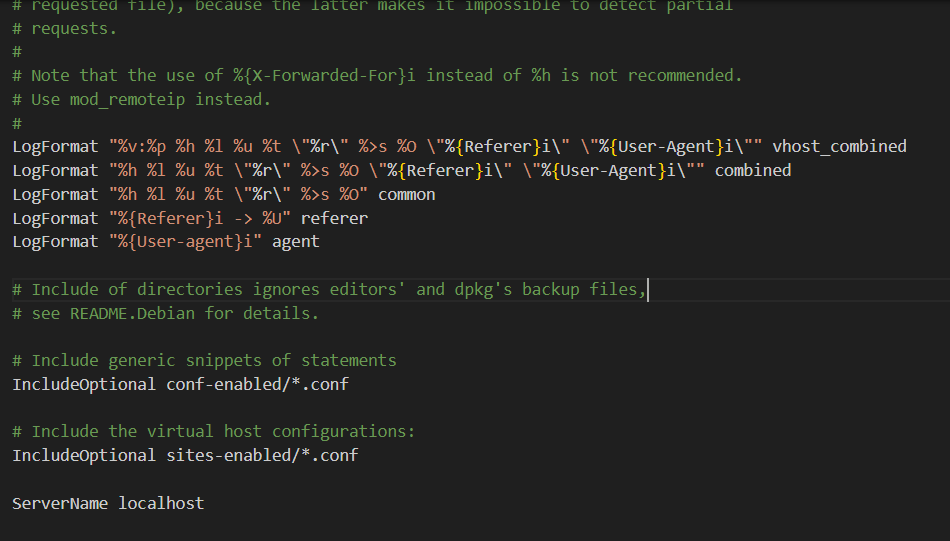
### Fisierul: files/php/php.ini
 - sa gasit linia:' ;error_log = php_errors.log ' și sa înlocuit cu linia: ' error_log = /var/log/php_errors.log '
 - sau gasit parametrii: memory_limit, upload_max_filesize, post_max_size și max_execution_time și sau setat astfel:
  - memory_limit = 128M
  - upload_max_filesize = 128M
  - post_max_size = 128M
  - max_execution_time = 120
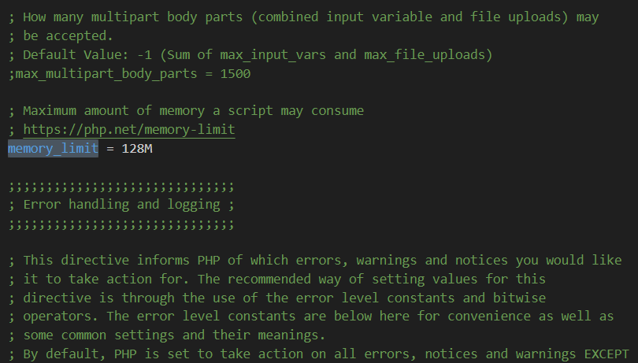
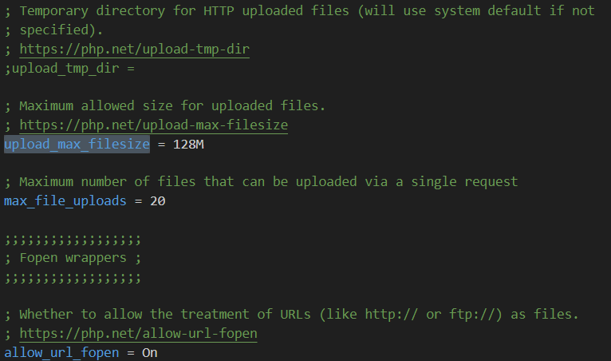
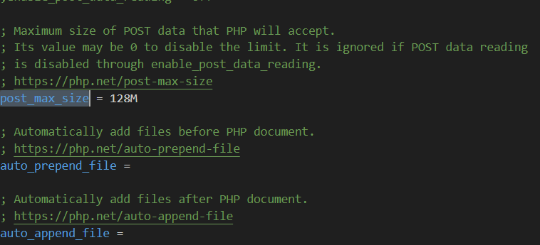
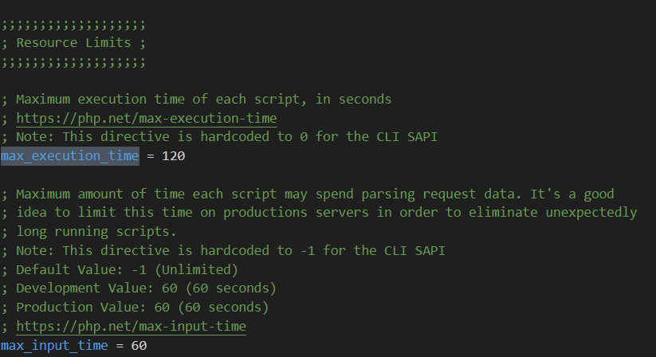
### Fisierul: files/mariadb/50-server.cnf
- sa gasit linia:' #log_error = /var/log/mysql/error.log ' și sa eliminat ' # ' din fata
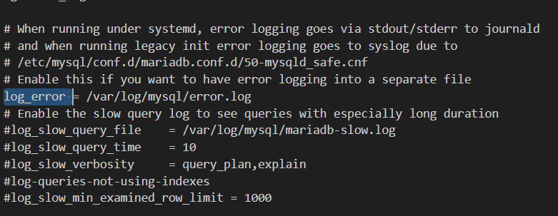

## Crearea scriptului de pornire
- in directorul files sa creat directorul ' supervisor ' cu fisierul ' supervisord.conf ' cu continutul:
```
[supervisord]
nodaemon=true
logfile=/dev/null
user=root

# apache2
[program:apache2]
command=/usr/sbin/apache2ctl -D FOREGROUND
autostart=true
autorestart=true
startretries=3
stderr_logfile=/proc/self/fd/2
user=root

# mariadb
[program:mariadb]
command=/usr/sbin/mariadbd --user=mysql
autostart=true
autorestart=true
startretries=3
stderr_logfile=/proc/self/fd/2
user=mysql
```

## Sa deschis fisierul Dockerfile si sa modificat in felul urmator:
```
FROM debian:latest

# mount volume for mysql data
VOLUME /var/lib/mysql

# mount volume for logs
VOLUME /var/log

RUN apt-get update && \
    apt-get install -y apache2 php libapache2-mod-php php-mysql mariadb-server supervisor && \
    apt-get clean

# add wordpress files to /var/www/html
ADD https://wordpress.org/latest.tar.gz /var/www/html/

RUN tar -xzf /var/www/html/latest.tar.gz -C /var/www/html --strip-components=1 && \
    rm /var/www/html/latest.tar.gz && \
    chown -R www-data:www-data /var/www/html

# copy the configuration file for apache2 from files/ directory
COPY files/apache2/000-default.conf /etc/apache2/sites-available/000-default.conf

COPY files/apache2/apache2.conf /etc/apache2/apache2.conf

# copy the configuration file for php from files/ directory
COPY files/php/php.ini /etc/php/8.2/apache2/php.ini

# copy the configuration file for mysql from files/ directory
COPY files/mariadb/50-server.cnf /etc/mysql/mariadb.conf.d/50-server.cnf

# copy the supervisor configuration file
COPY files/supervisor/supervisord.conf /etc/supervisor/supervisord.conf

# create mysql socket directory
RUN mkdir /var/run/mysqld && chown mysql:mysql /var/run/mysqld

EXPOSE 80

# start supervisor
CMD ["/usr/bin/supervisord", "-n", "-c", "/etc/supervisor/supervisord.conf"]
```

## Sa creat a doua versiune a imaginii apache2-php-mariadb
- Sa folosit comanda:
  - docker build -t apache2-php-mariadb .
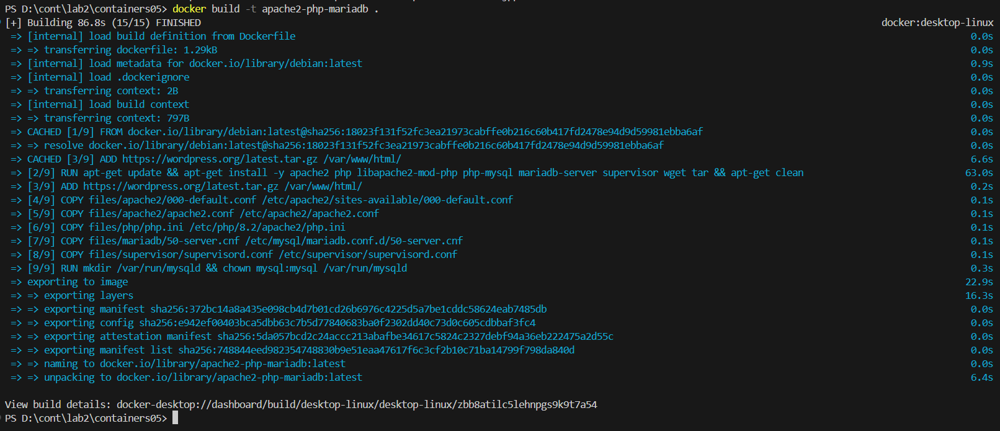

## Sa creat a doua versiune a conteinerului apache2-php-mariadb
- Sa folosit comanda:
  - docker container run -d --name apache2-php-mariadb apache2-php-mariadb
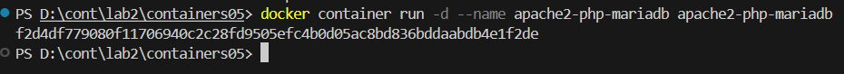

## Verificarea adresei http://localhost/:
- Sa accesat in browser adresa: http://localhost/
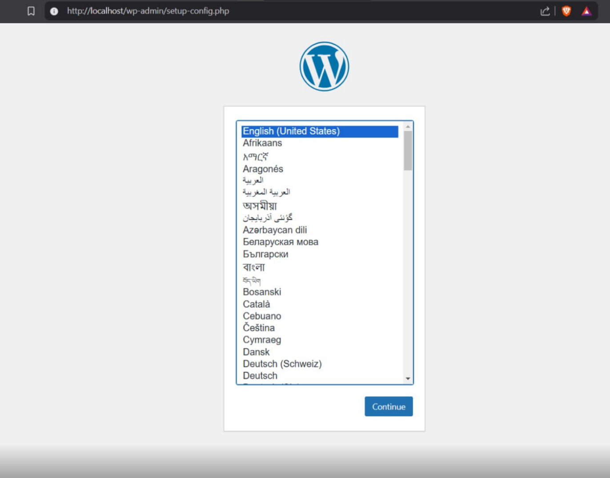

## Sa creat baza de date in container cu comenzile:
```
mysql
CREATE DATABASE wordpress;
CREATE USER 'wordpress'@'localhost' IDENTIFIED BY 'wordpress';
GRANT ALL PRIVILEGES ON wordpress.* TO 'wordpress'@'localhost';
FLUSH PRIVILEGES;
EXIT;
```
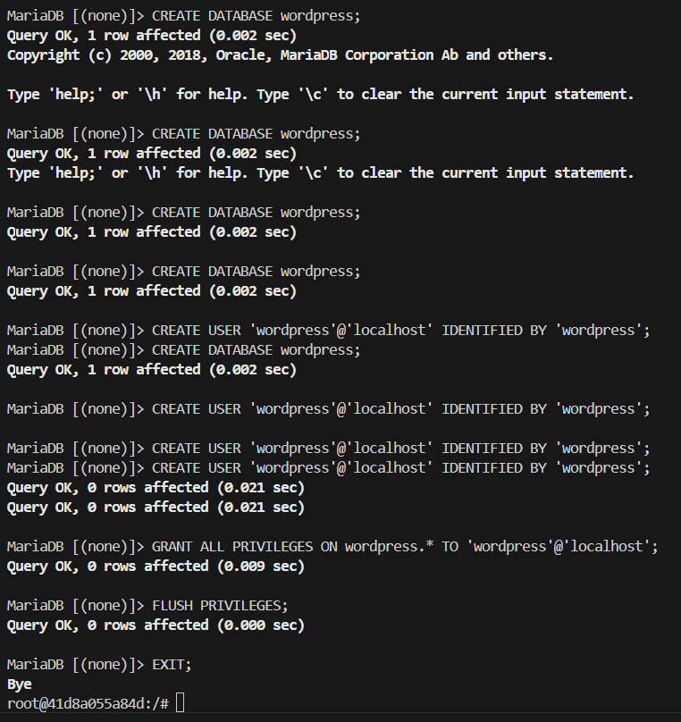

## Deschidem din nou http://localhost/ si efectuam setarea la wordpress
- la pasul 2 setam:
  - Numele bazei de date: wordpress;
  - Utilizatorul bazei de date: wordpress;
  - Parola bazei de date: wordpress;
  - Adresa bazei de date: localhost;
  - Prefixul tabelelor: wp_.

## Sa copiat fisierul wp-config.php din container in directorul files de pe calculator
 - sa folosit comanda:
  - docker cp apache2-php-mariadb:/var/www/html/wp-config.php files

## Modificam fisierul Dockerfile
- adaugam comanda:
  - COPY files/wp-config.php /var/www/html/wordpress/wp-config.php

## Recream imaginea si containerul apache2-php-mariadb
- Comenzile:
  - docker build -t apache2-php-mariadb .
  - docker container run -d --name apache2-php-mariadb apache2-php-mariadb
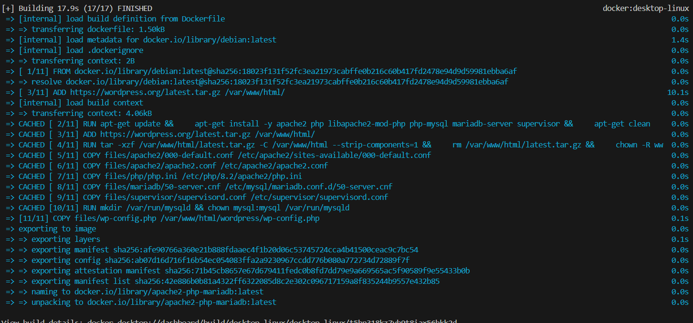
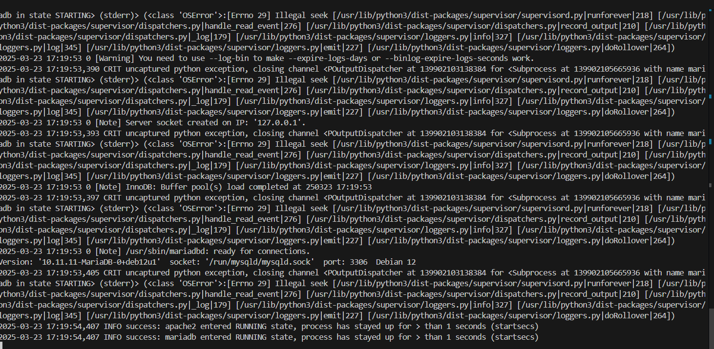

## Verificam http://localhost/ si functionalitatea saitului
- saitul este posibil de accesat si lucreaza complet
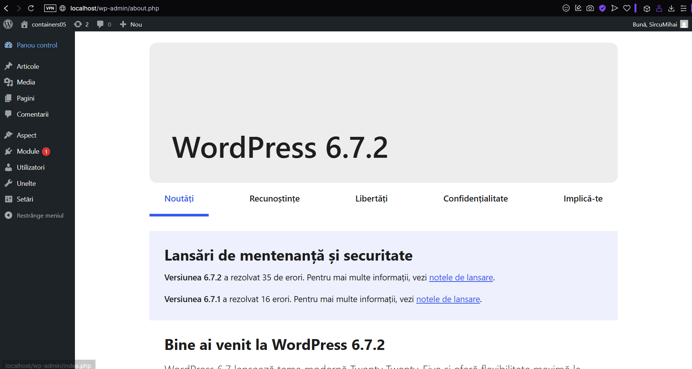

# Concluzie
- Acest laborator a demonstrat configurarea și rularea unui mediu WordPress utilizând containere Docker, precum și gestionarea fișierelor de configurare Apache2, PHP și MariaDB. S-a reușit rularea WordPress într-un container Docker, cu o bază de date configurată și fișierele necesare integrate corect în imaginea finală.

# Intrebari
## Ce fișiere de configurare au fost modificate?
 - Au fost modificate:
  - 000-default.conf
  - apache2.conf
  - php.ini
  - 50-server.cnf
  - wp-config.php
## Pentru ce este responsabilă instrucția DirectoryIndex din fișierul de configurare apache2?
 - Definește fișierul implicit servit de Apache atunci când un utilizator accesează o pagină web.
## De ce este necesar fișierul wp-config.php?
- Conține setările de conexiune la baza de date și configurația principală a WordPress.
## Pentru ce este responsabil parametrul post_max_size din fișierul de configurare php?
- Definește dimensiunea maximă a datelor transmise prin POST.
## Specificați, în opinia dvs., care sunt deficiențele imaginii containerului creat?
- Nu are un mecanism de securitate avansat.
- Datele bazei de date nu sunt persistente în afara containerului.
- Nu include un mecanism de backup automat al bazei de date.